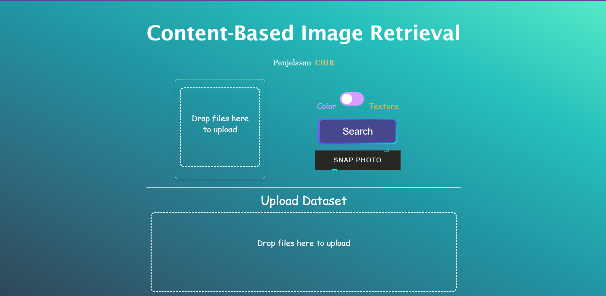
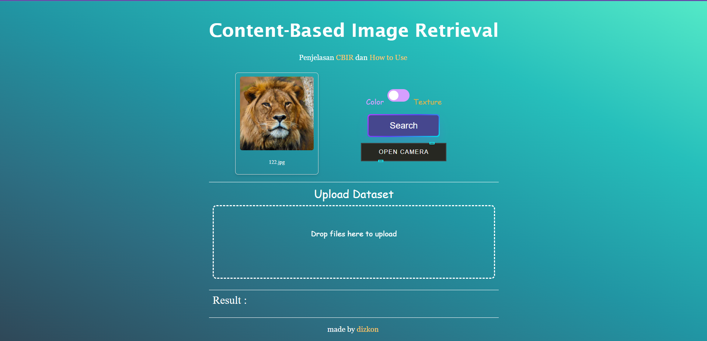
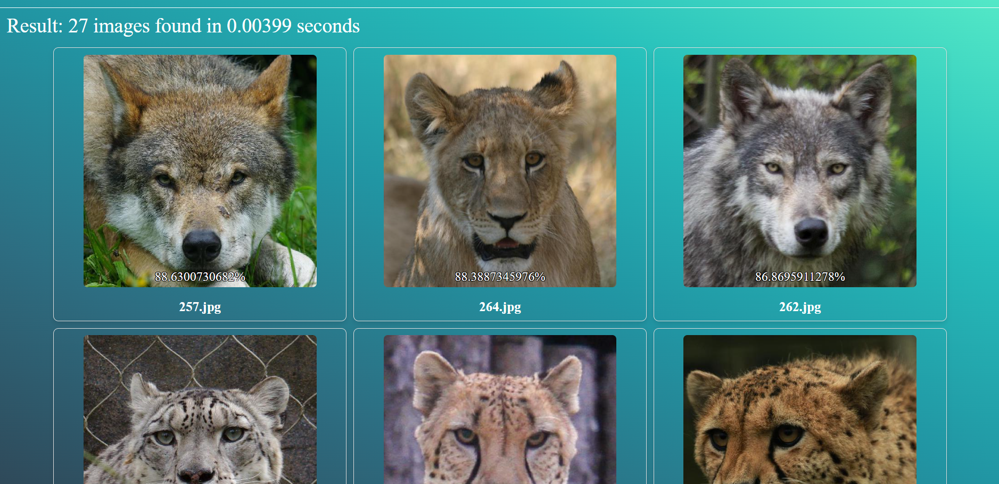

# Content-Based Image Retrieval Website

> Sebuah website yang menyediakan fitur pencarian gambar berdasarkan konten gambar.  
> Live demo [_di sini_](https://algeo02-22032.vercel.app/)

## Table of Contents

- [General Info](#general-information)
- [Technologies Used](#technologies-used)
- [Features](#features)
- [Screenshots](#screenshots)
- [Setup](#setup)
- [Usage](#usage)
- [Project Status](#project-status)
- [Room for Improvement](#room-for-improvement)
- [Acknowledgements](#acknowledgements)
- [Contact](#contact)
<!-- * [License](#license) -->

## General Information

- Sebuah website yang menyediakan fitur pencarian gambar berdasarkan konten gambar.
- Website ini dibuat dengan menggunakan bahasa pemrograman Python dan framework Django.
- Website ini dibuat untuk memenuhi tugas besar mata kuliah IF2123 Aljabar Linier dan Geometri, Teknik Informatika ITB, 2023/2024.

## Technologies Used

- Python - version 3.12
- Django - version 4.2.6
- asgiref - version 3.7.2
- numpy - version 1.26.2
- Pillow - version 10.1.0
- sqlparse - version 0.4.4
- tzdata - version 2023.3
- whitenoise - version 6.6.0

## Features

- Pencarian Gambar (CBIR) berdasarkan warna
- Pencarian Gambar (CBIR) berdasarkan tekstur
- input gambar query melalui upload gambar
- input gambar query melalui kamera
- input gambar dataset melalui upload gambar

## Screenshots

Tampilan Utama

Contoh Menambahkan Query

Contoh Hasil Pencarian

<!-- If you have screenshots you'd like to share, include them here. -->

## Setup

Setiap dependencies yang dibutuhkan sudah terdapat di requirements.txt.

Untuk menjalankan website ini, lakukan langkah-langkah berikut:

- Clone repository ini.
- akses terminal dari folder src.
- Lakukan install dependencies dengan menjalankan perintah `pip install -r requirements.txt` di terminal.
- Jalankan perintah `python manage.py runserver` di terminal.
- Buka http://127.0.0.1:8000/ di browser.

## Project Status

Project is: _completed_

## Room for Improvement

- Frontend design.
- media files bugs in deployment.
- keakuratan metode tekstur.

## Acknowledgements

- Projek ini ditugaskan pada mata kuliah IF2123 Aljabar Linier dan Geometri, Teknik Informatika ITB, 2023/2024.
- Terima kasih kepada Allah SWT atas segala karunia-Nya.
- Terima kasih sebesar-besarnya kepada dosen kami, Pak Rinaldi Munir, M.T.
- Terima kasih untuk Tazki, Dhidit, dan Vanson sudah menyelesaikan projek ini dan berkolaborasi dengan baik.

## Contact

Dibuat oleh dizkon

- 13522032 [@Tazkia Nizami](https://github.com/TazakiN)
- 13522040 [@Dhidit Abdi Aziz](https://github.com/dhiabziz)
- 13522049 [@Vanson Kurnialim](https://github.com/VansonK)
